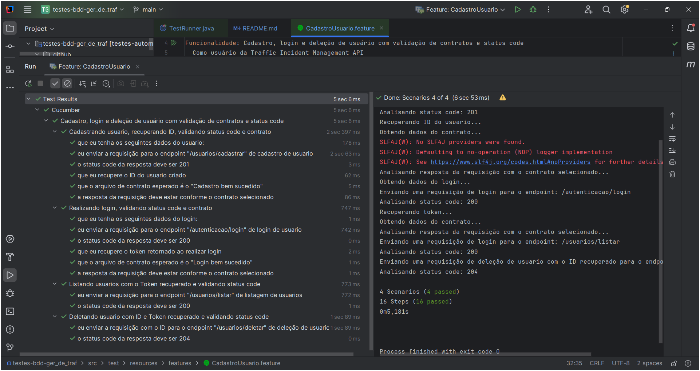
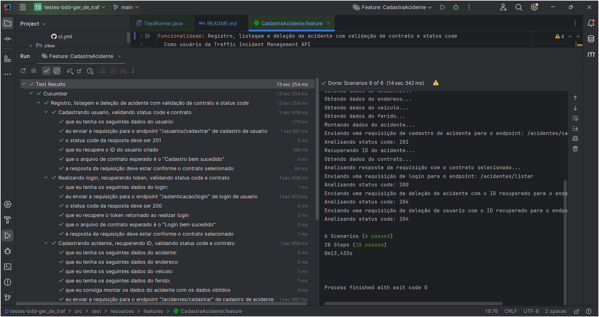
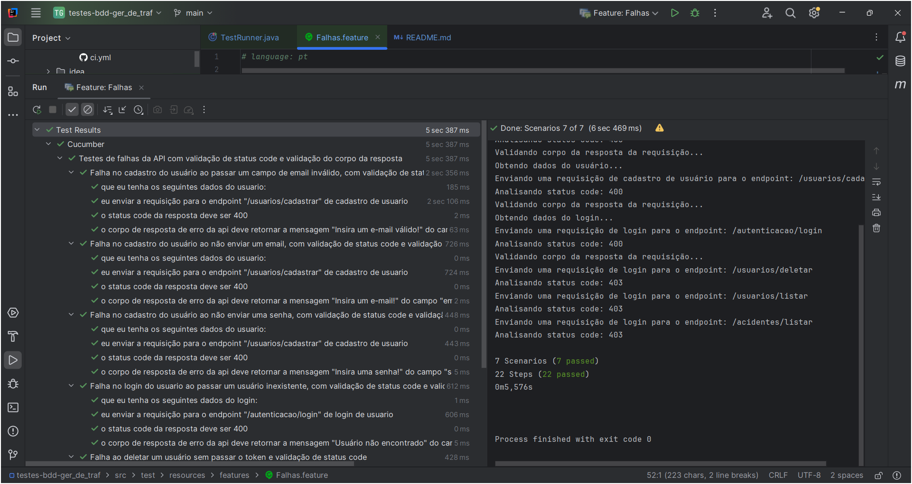
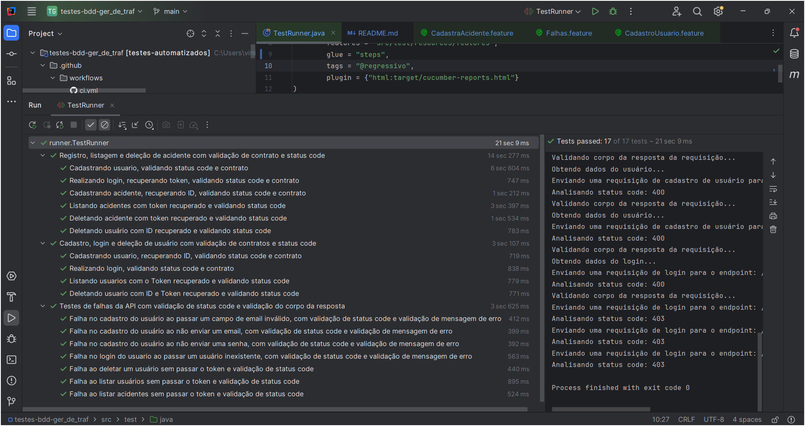
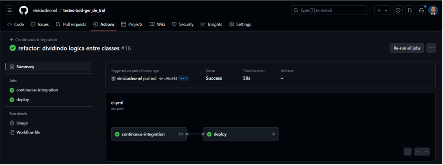
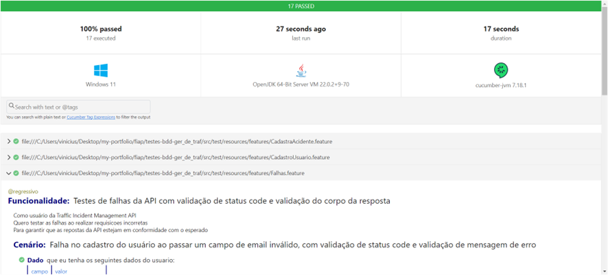

# Traffic Incident Management API

## Visão Geral

Esta aplicação é um conjunto de testes automatizados para a Traffic Incident Management API. 
Ela utiliza o framework Cucumber para definir cenários de teste em linguagem
natural e o Rest Assured para realizar requisições HTTP e validar respostas.

## Estrutura do Projeto

- **src/test/java/services**: Contém as classes de serviço que encapsulam a lógica de interação com a API.
- **src/test/resources/features**: Contém os arquivos de feature do Cucumber, que descrevem os cenários de teste.
- **src/test/java/steps**: Contém as definições dos passos do Cucumber, que ligam os cenários de teste à lógica de teste.
- **src/test/java/model**: Contém os modelos de dados utilizados para mapear as respostas da API.
- **src/test/resources/schemas**: Contém os esquemas JSON utilizados para validação de contrato das respostas da API.

## Funcionalidades

A aplicação cobre as seguintes funcionalidades:

1. **Cadastro de Usuário**: Criação de um novo usuário na API.
2. **Login de Usuário**: Autenticação de um usuário existente.
3. **Listagem de Usuários**: Listagem de todos os usuários.
4. **Cadastro de Acidente**: Registro de um acidente com detalhes como data, gravidade, endereço, veículos envolvidos e feridos.
5. **Listagem de Acidentes**: Listagem de todos os acidentes.
6. **Deleção de Acidente**: Remoção de um acidente existente da API.
7. **Deleção de Usuário**: Remoção de um usuário existente da API.

## Como Executar

1. **Pré-requisitos**: Certifique-se de ter o Java e o Maven instalados em sua máquina.

2. **Clonar o Repositório**:
   ```bash
   git clone https://github.com/viniciusleonel/testes-bdd-ger_de_traf
   cd testes-bdd-ger_de_traf
   ```

3. **Executar os Testes**:
   Utilize o Maven para executar os testes:
   ```bash
   mvn clean test
   ```

4. **Relatórios**:
   Após a execução dos testes, um relatório em HTML será gerado na pasta `target/cucumber-reports.html`.

## Configuração

- **Base URL**: A URL base da API está configurada na classe `ApiService` e pode ser alterada conforme necessário.
- **Esquemas JSON**: Os esquemas para validação de contrato estão localizados em `src/test/resources/schemas`.

## Links da API

[Github - Traffic Incident Management API](https://github.com/viniciusleonel/traffic-incident-management-api)

[Microsoft Azure Swagger- Traffic Incident Management API ](https://traffic-incident-api-dev-dtbtfvg2e7e7a8eq.eastus2-01.azurewebsites.net/swagger-ui/index.html)

[Microsoft Azure Base URL - Traffic Incident Management API ](https://traffic-incident-api-dev-dtbtfvg2e7e7a8eq.eastus2-01.azurewebsites.net)

## Tecnologias Utilizadas

- Java
- Maven
- Lombok
- Cucumber
- Gherkin
- Gson
- Rest Assured
- GitHub Actions

---

# Descrição dos Cenários de Teste em Gherkin

## Funcionalidade: Cadastro, login e deleção de usuário com validação de contratos e status code

Esta funcionalidade contém três cenários de teste que garantem o funcionamento correto do 
processo de cadastro, login e deleção de usuários na Traffic Incident Management API. 
Cada cenário é descrito em termos de pré-condições, ações e resultados esperados.



### Cenário 1: Cadastrando usuário, recuperando ID, validando status code e contrato

- **Dado** que eu tenha os seguintes dados do usuário:
   - **email**
   - **senha**
   - **role**
- **Quando** eu enviar a requisição para o endpoint "/usuarios/cadastrar" de cadastro de usuário
- **Então** o status code da resposta deve ser 201 (Criado)
- **Dado** que eu recupere o ID do usuário criado (Recupera o ID para uso no Cenário 3)
- **E** que o arquivo de contrato esperado é o "Cadastro bem sucedido"
- **Então** a resposta da requisição deve estar conforme o contrato selecionado

### Cenário 2: Realizando login, validando status code e contrato

- **Dado** que eu tenha os seguintes dados do login:
  - **email**
  - **senha**
- **Quando** eu enviar a requisição para o endpoint "/autenticacao/login" de login de usuário
- **Então** o status code da resposta deve ser 200 (OK)
- **Dado** que eu recupere o token retornado ao realizar login (Recupera o Token para uso no Cenário 3)
- **E** que o arquivo de contrato esperado é o "Login bem sucedido"
- **Então** a resposta da requisição deve estar conforme o contrato selecionado

### Cenário 3: Deletando usuário com ID e Token recuperado e validando status code

- **Quando** eu enviar a requisição com o ID para o endpoint "/usuarios/deletar" de deleção de usuário (Aqui é enviado o token de autenticação e o ID do usuário)
- **Então** o status code da resposta deve ser 204 (Sem Conteúdo)

## Conclusão

Esses cenários de teste são fundamentais para garantir que as operações de 
cadastro, login e deleção de usuários funcionem corretamente, assegurando a 
integridade dos dados e a conformidade com os contratos esperados.

---

## Funcionalidade: Registro, listagem e deleção de acidente com validação de contrato e status code

Esta funcionalidade contém vários cenários de teste que garantem o funcionamento correto do 
processo de registro de acidentes, listagem e deleção de acidentes na Traffic Incident Management API.
Cada cenário é descrito em termos de pré-condições, ações e resultados esperados.

Para que seja possivel realizar as requisições é necessário cadastrar um usuário e realizar
o login para a obtenção do token de autenticação. Ao final dos testes o usuário é deletado.



### Cenário 1: Cadastrando usuário, validando status code e contrato

- **Dado** que eu tenha os seguintes dados do usuário:
   - **email**
   - **senha**
   - **role**
- **Quando** eu enviar a requisição para o endpoint "/usuarios/cadastrar" de cadastro de usuário
- **Então** o status code da resposta deve ser 201 (Criado)
- **Dado** que eu recupere o ID do usuário criado (Recupera o ID para uso no Cenário 6)
- **E** que o arquivo de contrato esperado é o "Cadastro bem sucedido"
- **Então** a resposta da requisição deve estar em conformidade com o contrato selecionado

### Cenário 2: Realizando login, recuperando token, validando status code e contrato

- **Dado** que eu tenha os seguintes dados do login:
   - **email**
   - **senha**
- **Quando** eu enviar a requisição para o endpoint "/autenticacao/login" de login de usuário
- **Então** o status code da resposta deve ser 200 (OK)
- **Dado** que eu recupere o token retornado ao realizar login (Recupera o Token para uso em todos os Cenários seguintes)
- **E** que o arquivo de contrato esperado é o "Login bem sucedido"
- **Então** a resposta da requisição deve estar em conformidade com o contrato selecionado

### Cenário 3: Cadastrando acidente, recuperando ID, validando status code e contrato

- **Dado** que eu tenha os seguintes dados do acidente:
  - **dataHora**
  - **gravidade**
- **E** que eu tenha os seguintes dados do endereço:
  - **logradouro**
  - **numero**
  - **bairro**
  - **cep**
  - **cidade**
  - **estado**
- **E** que eu tenha os seguintes dados do veículo:
  - **placa**
  - **modelo**
  - **ano**
  - **cor**
- **E** que eu tenha os seguintes dados do ferido:
  - **nome**
  - **cpf**
  - **gravidade**
- **E** que eu consiga montar os dados do acidente com os dados obtidos
- **Quando** eu enviar a requisição para o endpoint "/acidentes/cadastrar" de cadastro de acidente (Aqui é enviado o token de autenticação)
- **Então** o status code da resposta deve ser 201 (Criado)
- **Dado** que eu recupere o ID do acidente registrado (Recupera o ID para uso no Cenário 5)
- **E** que o arquivo de contrato esperado é o "Acidente cadastrado"
- **Então** a resposta da requisição deve estar conforme o contrato selecionado

### Cenário 4: Listando acidentes com token recuperado e validando status code

- **Quando** eu enviar a requisição para o endpoint "/acidentes/listar" de listagem de acidentes (Aqui é enviado o token de autenticação)
- **Então** o status code da resposta deve ser 200 (OK)

### Cenário 5: Deletando acidente com token e ID recuperados e validando status code

- **Quando** eu enviar a requisição com o ID para o endpoint "/acidentes/deletar" de deleção de acidente (Aqui é enviado o token de autenticação e o ID do acidente)
- **Então** o status code da resposta deve ser 204 (Sem Conteúdo)

### Cenário 6: Deletando usuário com ID recuperado e validando status code

- **Quando** eu enviar a requisição com o ID para o endpoint "/usuarios/deletar" de deleção de usuário (Aqui é enviado o token de autenticação e o ID do usuário)
- **Então** o status code da resposta deve ser 204 (Sem Conteúdo)

## Conclusão

Esses cenários de teste são essenciais para garantir que as operações de 
registro, listagem e deleção de acidentes funcionem corretamente, assegurando 
a integridade dos dados e a conformidade com os contratos esperados.

---

## Funcionalidade: Testes de falhas da API com validação de status code e validação do corpo da resposta

Esta funcionalidade contém vários cenários de teste que garantem que a Traffic Incident Management API
responda corretamente a requisições incorretas. 
Cada cenário é descrito em termos de pré-condições, ações e resultados esperados.



### Cenário 1: Falha no cadastro do usuário ao passar um campo de email inválido, com validação de status code e validação de mensagem de erro

- **Dado** que eu tenha os seguintes dados do usuário:
  - **email** (inválido)
  - **senha**
  - **role**
- **Quando** eu enviar a requisição para o endpoint "/usuarios/cadastrar" de cadastro de usuário
- **Então** o status code da resposta deve ser 400 (Requisição Inválida)
- **E** o corpo de resposta de erro da API deve retornar a mensagem "Insira um e-mail válido!" do campo "email"

### Cenário 2: Falha no cadastro do usuário ao não enviar um email, com validação de status code e validação de mensagem de erro

- **Dado** que eu tenha os seguintes dados do usuário:
  - **email** (vazio)
  - **senha**
  - **role**
- **Quando** eu enviar a requisição para o endpoint "/usuarios/cadastrar" de cadastro de usuário
- **Então** o status code da resposta deve ser 400 (Requisição Inválida)
- **E** o corpo de resposta de erro da API deve retornar a mensagem "Insira um e-mail!" do campo "email"

### Cenário 3: Falha no cadastro do usuário ao não enviar uma senha, com validação de status code e validação de mensagem de erro

- **Dado** que eu tenha os seguintes dados do usuário:
   - **email** 
   - **senha** (vazio)
   - **role**
- **Quando** eu enviar a requisição para o endpoint "/usuarios/cadastrar" de cadastro de usuário
- **Então** o status code da resposta deve ser 400 (Requisição Inválida)
- **E** o corpo de resposta de erro da API deve retornar a mensagem "Insira uma senha!" do campo "senha"

### Cenário 4: Falha no login do usuário ao passar um usuário inexistente, com validação de status code e validação de mensagem de erro

- **Dado** que eu tenha os seguintes dados do login:
   - **email** (inexistente)
   - **senha** 
   - **role**
- **Quando** eu enviar a requisição para o endpoint "/autenticacao/login" de login de usuário
- **Então** o status code da resposta deve ser 400 (Requisição Inválida)
- **E** o corpo de resposta de erro da API deve retornar a mensagem "Usuário não encontrado" do campo "message"

### Cenário 5: Falha ao deletar um usuário sem passar o token e validação de status code

- **Quando** eu enviar a requisição para o endpoint "/usuarios/deletar" de deleção de usuário
- **Então** o status code da resposta deve ser 403 (Proibido)

### Cenário 6: Falha ao listar usuários sem passar o token e validação de status code

- **Quando** eu enviar a requisição para o endpoint "/usuarios/listar" de listagem de usuários
- **Então** o status code da resposta deve ser 403 (Proibido)

### Cenário 7: Falha ao listar acidentes sem passar o token e validação de status code

- **Quando** eu enviar a requisição para o endpoint "/acidentes/listar" de listagem de acidentes
- **Então** o status code da resposta deve ser 403 (Proibido)

## Conclusão

Esses cenários de teste são cruciais para garantir que a API responda adequadamente a requisições incorretas, assegurando que os status codes e as mensagens de erro estejam em conformidade com o esperado.

---

Print de todos os testes concluidos 



---

Print GitHub Actions



---

Print Cucumber Reports

